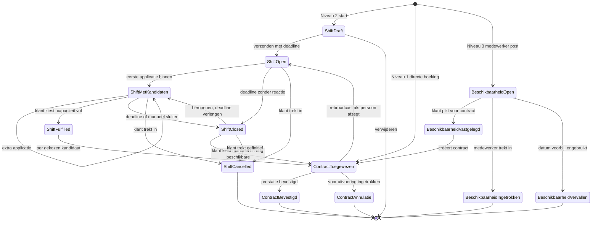
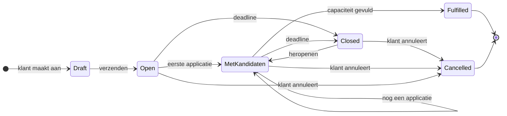
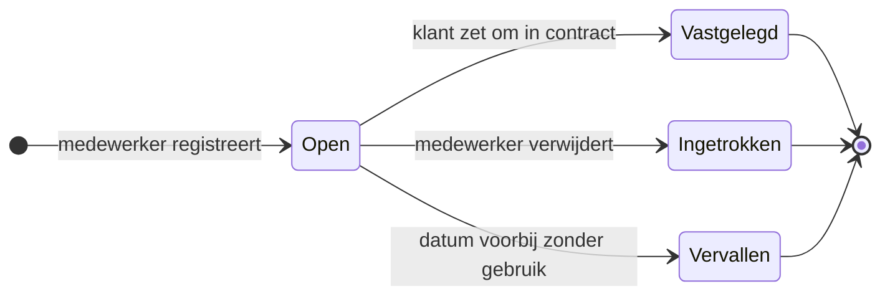
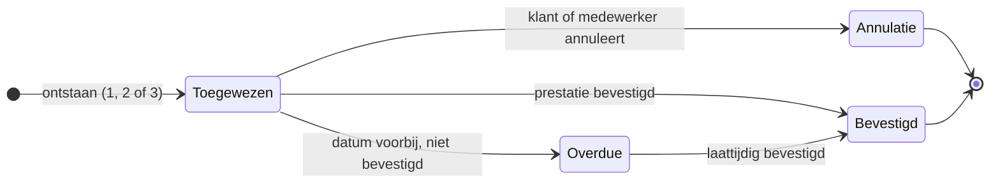

# Levensloop van een planning-blokje

Een blokje in het planscherm is visueel één ding, maar onder de motorkap kan het verschillende entiteiten vertegenwoordigen, afhankelijk van hoe het ontstaan is. De volledige levensloop omvat drie objecten met elk hun eigen states, plus de manier waarop ze in elkaar overgaan.

De objecten zijn:

- Beschikbaarheid (medewerker-aanbod, niet bedrijfsgebonden)
- Shift (klant-vraag, bedrijf-gebonden, optioneel met kandidaten)
- Contract (matchresultaat, gekoppeld aan medewerker en loonpakket)

Een Prestatie is geen apart object in het planscherm: een Contract gaat in zijn levensloop over van Toegewezen naar Bevestigd-als-Prestatie.

## Drie ingangen, één convergentiepunt

Elk planning-blokje eindigt als een Contract (al dan niet met Prestatie-bevestiging erna). Wat verschilt is de instap.

### Ingang Niveau 1: directe boeking

De klant kent persoon en uren. Hij maakt een Contract aan zonder Shift of Beschikbaarheid als bron. Het blokje bestaat onmiddellijk in staat Toegewezen Contract.

```
[klikt op cel + kiest naam] → Contract Toegewezen → Prestatie Bevestigd
```

### Ingang Niveau 2: shift-broadcast

De klant kent uren en functie, niet de persoon. Hij bouwt een Shift in Draft, verzendt, en wacht op kandidaten. Het blokje doorloopt minstens twee tussenstaten voor het Contract wordt.

```
Shift Draft → Shift Open → Shift Met Kandidaten → Shift Fulfilled (= Contract Toegewezen) → Prestatie Bevestigd
```

Bij capaciteit groter dan 1 spawnen meerdere Contracten uit één Fulfilled Shift.

### Ingang Niveau 3: beschikbaarheid-pull

De medewerker post een Beschikbaarheid. De klant ziet die staan in de pool-lijst, klikt en zet om in een Contract. De Beschikbaarheid wordt Vastgelegd en verdwijnt uit de aanbod-lijst.

```
Beschikbaarheid Open → (klant pikt) → Contract Toegewezen → Prestatie Bevestigd
                                          ↑ Beschikbaarheid Vastgelegd
```

## Volledige state diagram

Eén consolidatie van alle ingangen en transities.



## Per entity nader bekeken

### Shift

Een Shift is de vraag van de klant zonder vastgelegde persoon. Levensduur van Draft tot Cancelled, met Toegewezen Contracten als output.



Belangrijk:

- Open en Met Kandidaten verschillen alleen in aanwezigheid van applicaties. Visueel reeds onderscheid: badge met teller.
- Closed is een tijdelijke parkeerstand. De klant kan heropenen, manueel kiezen, of definitief annuleren.
- Fulfilled betekent dat alle capaciteit gevuld is. Voor capaciteit 1 betekent dit: één kandidaat gekozen.

### Beschikbaarheid

Eigendom van de Medewerker. Cross-bedrijf zichtbaar voor pools waar hij in zit.



Edge case bij gedeeltelijke booking: medewerker geeft 12-19 op, klant boekt 12-17. Voorstel: oorspronkelijke beschikbaarheid wordt Vastgelegd voor 12-17, een nieuwe Beschikbaarheid Open ontstaat voor 17-19. Dit gebeurt automatisch bij het systeem en is voor de medewerker transparant.

### Contract

Het convergentiepunt van alle drie de ingangen.



Source-veld op Contract houdt bij waar het vandaan komt: NIVEAU_1_DIRECT, NIVEAU_2_SHIFT, NIVEAU_3_BESCHIKBAARHEID. Voor analytics (welk percentage van contracten kwam uit shift-broadcast?) en audit-trail.

## Mengvormen tussen niveaus

In de praktijk gaan flows in elkaar over. Die overgangen zijn expliciet ondersteund.

### 2 → 1: shift zonder kandidaten

Klant heeft een Shift gemaakt, deadline is voorbij, 0 kandidaten. Hij wil het werk toch gepland krijgen. Vanuit Shift Closed kan hij:

- Manueel een naam kiezen uit de pool. Shift Closed → Contract Toegewezen.
- De shift heropenen met een nieuwe deadline. Shift Closed → Met Kandidaten (als er kandidaten waren) of Open (als er geen waren).
- Shift annuleren en niets doen.

### 2 → 3: shift met kandidaten naast beschikbaren

Klant heeft een open Shift met 2 kandidaten op vrijdag. Hij ziet in zijn pool dat een derde persoon op dezelfde dag beschikbaarheid heeft gepost zonder zich kandidaat te stellen. Hij kan:

- Die derde persoon "uitnodigen" voor de shift (notificatie via MyStaffler).
- Die derde persoon direct vastleggen op een nieuwe shift (parallel) of op dezelfde shift als de capaciteit verhoogd wordt.

### 1 → 2: dubbel boeken via broadcast

Klant heeft persoon X manueel ingepland op woensdag (Niveau 1). Op donderdag wil hij ook iemand maar weet niet wie. Hij maakt een Shift voor donderdag (Niveau 2). De twee blokjes leven naast elkaar, het systeem maakt geen aanname.

### 3 → 2: beschikbaarheid omgezet in shift-broadcast

Klant ziet 3 medewerkers beschikbaar voor donderdag, kan niet kiezen. Hij maakt een Shift met selectie = die 3 namen. De beschikbaarheid blijft staan tot iemand zich kandidaat stelt. De geselecteerde wordt Contract, de Beschikbaarheid Vastgelegd.

## Visuele staten in het planscherm

Hoe vertaalt zich dit naar wat de klant op zijn scherm ziet?

| Object-state | Visueel blokje | Interactie |
|---|---|---|
| Shift Draft | dikke rand, "concept" label | klikbaar voor verder bouwen |
| Shift Open, 0 kandidaten | dashed border, amber bg, badge "0" | klikbaar voor edit of cancel |
| Shift Met Kandidaten, n>0 | dashed border, amber bg, badge "n" | klikbaar voor kandidatenlijst |
| Shift Closed | dashed border, gray bg, badge "expired" | klikbaar voor heropen, manueel kiezen, cancel |
| Shift Fulfilled | wordt vervangen door Contract-blokje |  |
| Contract Toegewezen | solid border, blauw, naam zichtbaar | klikbaar voor edit, cancel, herplannen |
| Contract Overdue | solid border, oranje rand, "bevestiging?" badge | klikbaar voor bevestiging |
| Contract Bevestigd | solid border, gray, "bevestigd" badge | enkel raadplegen |
| Contract Annulatie | doorgehaalde stijl, "geannuleerd" | enkel raadplegen, eventueel rebroadcast-actie |

Beschikbaarheid Open verschijnt niet als blokje in de grid maar in de pool-strook of side panel als sleepbare kaart.

## Tijds-as: deadlines en cron

De levensloop heeft enkele tijdsgebonden transities die door cron-jobs of EventBridge schedules getriggerd worden.

| Transitie | Trigger | Voorgestelde frequentie |
|---|---|---|
| Shift Open → Closed | deadline-tijdstip | event-driven, exact moment |
| Beschikbaarheid Open → Vervallen | datum verstreken | dagelijks om 03:00 |
| Contract Toegewezen → Overdue | datum verstreken zonder bevestiging | dagelijks dinsdag 00:01 (zoals nu) |
| Reminder push naar kandidaten | t-1u voor deadline | event-driven |
| Reminder push voor confirmation | maandag 07:00 (zoals nu) | bestaande cron |

Past goed binnen de bestaande EventBridge-architectuur (zie ActualsLockForPaymentSchedule, NotificationServiceSchedule). Real-time push voor kandidaten-notificaties zou een upgrade vragen op NotificationServiceSchedule (nu 15 min).

## Audit-trail en analytics

Per Contract bewaren:

- source enum (NIVEAU_1_DIRECT / NIVEAU_2_SHIFT / NIVEAU_3_BESCHIKBAARHEID)
- shift_id of beschikbaarheid_id als bron
- aantal kandidaten op moment van keuze (alleen bij niveau 2)
- tijd tussen broadcast en eerste kandidaat
- tijd tussen broadcast en keuze
- klant-aanleiding bij annulatie (vrij tekstveld of dropdown)

Maakt later analyse mogelijk: hoe snel reageert onze pool, welke klanten gebruiken welk niveau, waar zit fulfilment-risico.
